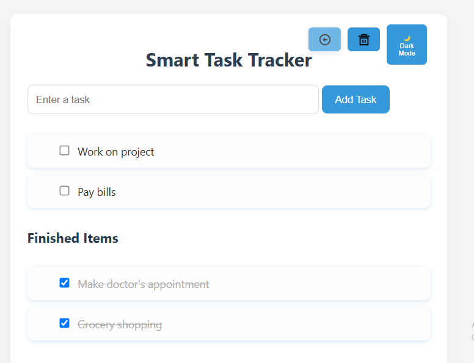
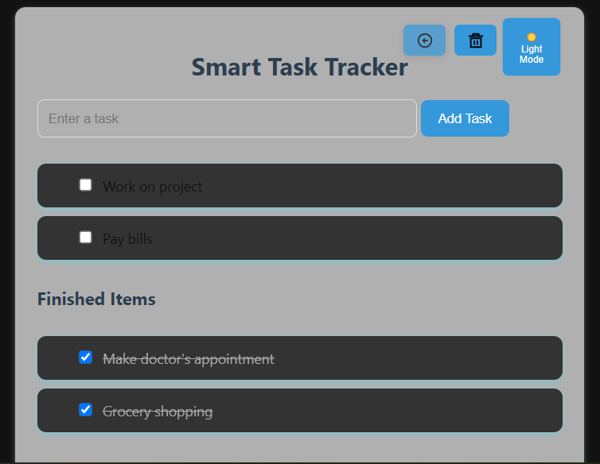
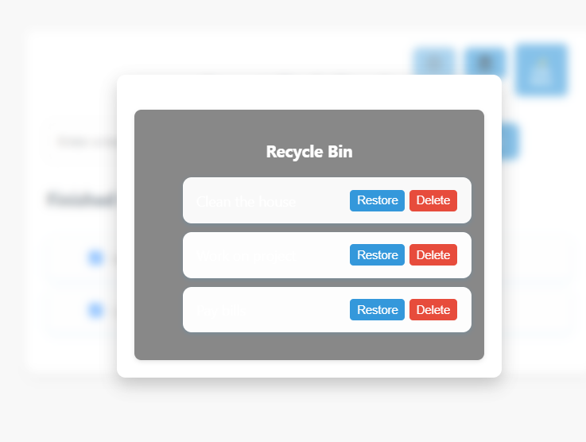
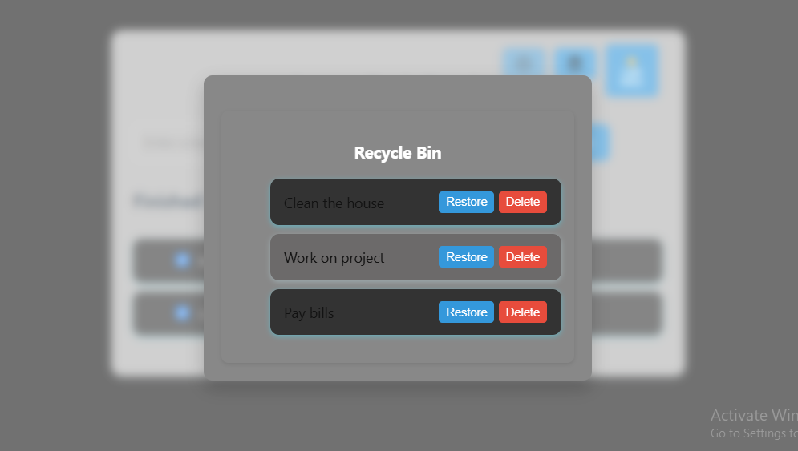

# smart-task-tracker

This is a minimalist and responsive to-do list application built using HTML, CSS, and JavaScript. It provides a full suite of task management features including active, completed, deleted, and restored tasks. The app supports a clean monochromatic dark mode and uses local storage to persist tasks and user preferences across browser sessions.

#Features

Add, complete, delete, and restore tasks.
Deleted tasks are moved to a Recycle Bin where they can be restored or permanently removed.
Undo functionality for the most recent deletion.

#Getting Started

#Prerequisites

A modern web browser is required. No additional dependencies or installations are needed.

# Setup Instructions
Clone or download the project repository.
Open the index.html file in your browser.
Begin using the app. Tasks and settings will be saved automatically.

# How It Works

Dark Mode: A toggle adds or removes the .dark-mode class from the <body> element. Styles defined under this class in styles.css are applied accordingly.

#Task Lifecycle:

New tasks are added to the main task list.
Completed tasks move to the "done" list with a checked checkbox.
Deleted tasks are moved to the bin and can be restored or permanently deleted.
The Undo button restores the most recently deleted task.

#Technologies Used

HTML5
CSS3
JavaScript (ES6)

#Potential Improvements

Add drag-and-drop support for task ordering
Implement task due dates and notification reminders
Add inline task editing
Convert the app to a Progressive Web App (PWA)

## Screenshots

### Light Mode

### Dark Mode

### Bin View

### Bin Dark Mode

Author
Developed by Musa Dondolo as a demonstration of functional, minimal, and modern front-end design using plain JavaScript and browser-native features.
